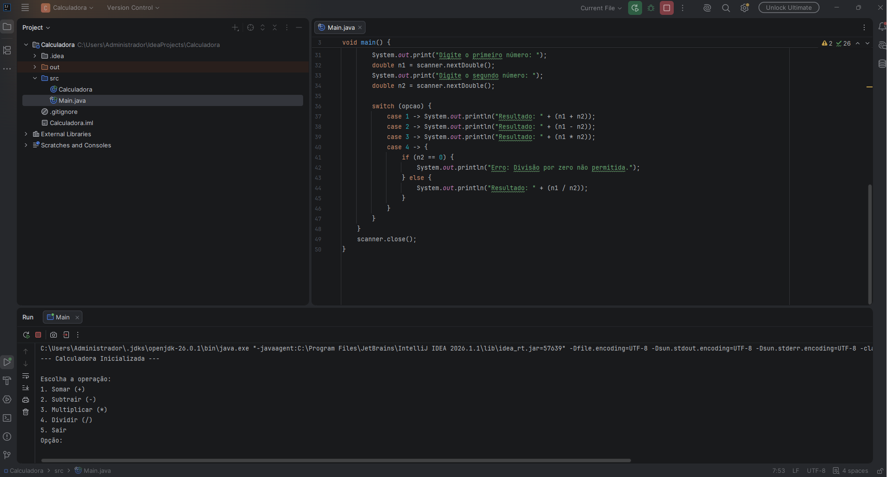

# Calculadora Básica em Java

Projeto desenvolvido em Java focado em praticar lógica de programação, estruturas condicionais e laços de repetição durante o início da graduação.

# Funcionalidades

* **Menu Interativo:** Menu funcional que roda em loop até que o usuário decida sair.
* **Operações Básicas:**
  * Soma (+)
  * Subtração (-)
  * Multiplicação (*)
  * Divisão (/)
* **Validação de Erros:** Onde o sistema impede e avisa caso ocorra uma tentativa de divisão por zero.

# Tecnologias utilizadas

* Java
* IntelliJ IDEA
* Git
* GitHub

# Conceitos aplicados

* Estruturas de repetição (`while`)
* Estruturas condicionais (`if` / `else`)
* Controle de fluxo (`switch-case`)
* Entrada de dados (`Scanner`)
  
# Demonstração do funcionamento

